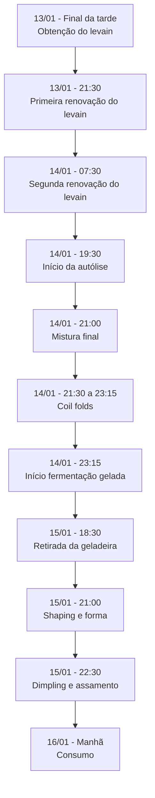

# Primeira Focaccia de 2025

Uma focaccia de fermentação natural, desenvolvida em dois dias, utilizando técnica de autólise e fermentação em temperatura controlada. O resultado foi uma focaccia aerada, com sabor levemente ácido e textura equilibrada.

## Informações Técnicas
- **Rendimento**: 1 focaccia grande
- **Hidratação Total**: 100%
- **Porcentagem de Levain**: 20%

## Cronograma



## Ingredientes e Percentuais

### Levain Final (manhã do dia 14/01)
| Ingrediente | Quantidade | Percentual do Padeiro |
|------------|------------|----------------------|
| Levain maduro | 20g | - |
| Água fria | 60g | - |
| Farinha forte (La Manitoba) | 90g | - |

### Massa Principal
| Ingrediente | Quantidade | Percentual do Padeiro |
|------------|------------|----------------------|
| Farinha 5 Stagioni ORO | 375g | 100% |
| Água (autólise) | 280g | 74.7% |
| Levain | 75g | 20% |
| Água (levain) | 85g | 22.7% |
| Sal | 7.5g | 2% |
| Água (sal) | 10g | 2.7% |

### Cobertura
- Azeite de oliva extra virgem
- Tomates cereja cortados ao meio
- Alecrim fresco
- Sal grosso

## Equipamentos Utilizados
- Batedeira com gancho
- Coqueteleira (para diluição)
- Recipiente para fermentação
- Forma para focaccia
- Forno a gás com pedra refratária
- Forno elétrico
- Termômetro
- Grade de resfriamento

## Processo Detalhado

### Dia 13/01/2025
```admonish info
- Final da tarde: Obtenção do levain ativo no ponto ideal
- 21:30: Primeira renovação (1:2:3)
  - 20g levain
  - 40g água temperatura ambiente
  - 60g farinha
```

### Dia 14/01/2025
```admonish info
- 07:30: Segunda renovação (1:3:4.5)
  - 20g levain
  - 60g água fria
  - 90g farinha La Manitoba
- 12:00: Levain duplicou (200ml marca)
- 19:30: Levain quadruplicou e começou a cair (400ml marca)
- 19:30: Início da autólise
  - 375g farinha 5 Stagioni ORO
  - 280g água
- 21:00: Mistura final
  - Levain (75g) diluído em água (85g)
  - Sal (7.5g) diluído em água (10g)
  - Mistura na batedeira até desgrudar (~20min)
- 21:30 - 23:15: Coil folds a cada 30min
- 23:15: Início da fermentação gelada
```

### Dia 15/01/2025
```admonish info
- 18:30: Retirada da geladeira
- 21:00: Shaping e transferência para forma
- 22:30: Finalização e assamento
  - Dimpling
  - Adição de cobertura
  - 30min no forno a gás (250°C)
  - 8min no forno elétrico para gratinar
```

## Documentação do Resultado

### Observações Técnicas
```admonish note
- Desenvolvimento da massa mais rápido que o usual (20min)
- Levain passou do ponto ideal antes da mistura final
- Temperatura ambiente média: 25°C
```

### Características do Produto Final
```admonish success
- Miolo bem aerado
- Base crocante quando recém-assada
- Sabor levemente ácido
- Textura macia no dia seguinte
- Coloração irregular na superfície
```

### Análise Crítica

#### Pontos Positivos
```admonish check
- Boa aeração do miolo
- Sabor equilibrado
- Textura macia e agradável
- Boa aceitação familiar
```

#### Pontos de Melhoria
```admonish tip
- Para sabor mais neutro: usar levain no ponto máximo
- Considerar redução do tempo de fermentação gelada
- Trabalhar na uniformidade da coloração
- Consumo imediato para máxima crocância
```
