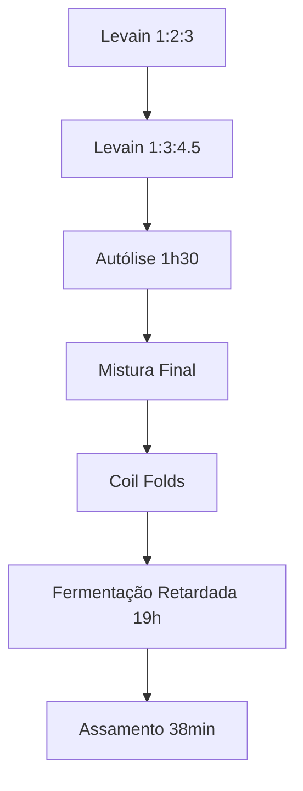

# Primeira Focaccia de 2025  
*Focaccia de fermentação natural com tomate cereja, alecrim e toque azedo característico*  

---

## Informações Técnicas  
- **Rendimento**: 1 focaccia (forma ~28x38cm)  
- **Hidratação Total**: 86%  
- **% Levain na massa**: 10.5%  
- **Temperatura ambiente**: ~25°C (verão)  
- **Farinhas utilizadas**:  
  - 5 Stagioni ORO (massa principal)  
  - La Manitoba 13% (levain)  

---

## Cronograma Processual  

### Dia 13/01/2025  
| Hora   | Ação                  | Detalhes                                  |
|--------|-----------------------|-------------------------------------------|
| 21:30  | 1ª Renovação do Levain | 20g levain + 40g água + 60g farinha Manitoba |

### Dia 14/01/2025  
| Hora   | Ação                  | Detalhes                                  |
|--------|-----------------------|-------------------------------------------|
| 07:30  | 2ª Renovação do Levain | 20g levain + 60g água fria + 90g farinha Manitoba |
| 19:30  | Início da Autólise    | 280g água + 375g farinha 5 Stagioni       |
| 21:00  | Mistura Final         | +75g levain +85g água +7.5g sal dissolvido |
| 21:30  | 1º Coil Fold          | Início sequência de folds                 |
| 22:00  | 2º Coil Fold          |                                           |
| 22:30  | 3º Coil Fold          |                                           |
| 23:15  | 4º Coil Fold          | Transferência para geladeira              |

### Dia 15/01/2025  
| Hora   | Ação                  | Detalhes                                  |
|--------|-----------------------|-------------------------------------------|
| 18:30  | Retirada da Geladeira | Aclimatação por 2h30                      |
| 21:00  | Formatura             | Dobra tipo "shaping" + azeite na superfície |
| 22:30  | Assamento             | 30min forno gás (250°C) + 8min forno elétrico |

---

## Formulação  

### Ingredientes Principais  
| Componente       | Massa (g) | % Baker's |
|------------------|-----------|-----------|
| Farinha TOTAL    | 465       | 100%      |
| Água TOTAL       | 401       | 86%       |
| Sal              | 7.5       | 1.6%      |
| Levain           | 75        | 16.1%     |

```
Hidratação = (Água Total 401g / Farinha Total 465g) × 100 = 86%
```

---

## Protocolo Técnico  

### 1. Gestão do Levain  
```
13/01 21:30: Alimentação 1:2:3 (20g:40g:60g)
14/01 07:30: Alimentação 1:3:4.5 (20g:60g:90g) com água fria
Comportamento: 100g → 200g (5h) → 400g (12h) → queda
```

### 2. Desenvolvimento da Massa  
```
19:30-21:00: Autólise (1h30)
21:00-21:20: Mistura final (batedeira velocidade máxima)
Textura observada: "Descolou do bowl em 20min"
```

### 3. Regime Térmico  
```
Fermentação Primária: 1h45 @25°C
Fermentação Retardada: 19h15 @4°C
```

---

## Análise Sensorial  

### Resultados Obtidos  
```
- Miolo: Aerado com bolhas irregulares
- Sabor: Azedinho marcante
- Crocância: Base crocante inicial → maciez após 12h
- Cor: Irregular com pontos escuros
```

### Matriz de Melhorias  
| Fator                | Problema                          | Solução Proposta               |
|----------------------|-----------------------------------|---------------------------------|
| Controle do Levain   | Usado após queda (400g)           | Coletar no ápice (300-350g)    |
| Temperatura de Forno | Gradiente desigual                | Pré-aquecer pedra por 1h       |
| Conservação          | Perda de crocância                | Reaquecimento a 180°C por 5min |

---

## Fluxograma do Processo  


---

## Insights Chave  
```
• Estratégia de hidratação (86%) compensou temperatura elevada
• Uso combinado de farinhas garantiu estrutura equilibrada
• Dimpling realizado com massa fria permitiu melhor distribuição
```

---

## Nota Técnica Final  
> "O tempo total de fermentação (21h) explica o sabor azedo pronunciado. Para versão mais neutra: reduzir fermentação retardada para 12h e usar levain no pico máximo."

✂️ **Corte Transversal Documentado**:  
  
*(Ilustração conceitual - substituir por foto real)*