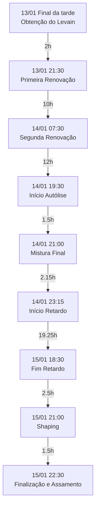

# Primeira Focaccia de 2025

## Introdução
Uma focaccia de fermentação natural com retardo em geladeira, utilizando farinha italiana tipo 00 e finalizada com tomates cereja, alecrim e sal grosso. O processo se estendeu por três dias, incluindo o preparo do levain e fermentação refrigerada.

```admonish info
**Informações Técnicas**
- Rendimento: 1 focaccia
- Hidratação Total: 78.5%
- Porcentagem de Levain na Massa Final: 20%
```

## Ingredientes

### Levain
| Ingrediente | Quantidade | Baker's % |
|------------|------------|-----------|
| Levain Maduro | 20g | 22.2% |
| Água Fria | 60g | 66.7% |
| Farinha Manitoba 13% | 90g | 100% |

### Massa Principal
| Ingrediente | Quantidade | Baker's % |
|------------|------------|-----------|
| Farinha 5 Stagioni ORO | 375g | 100% |
| Água | 280g + 85g + 10g | 100% |
| Levain Maduro | 75g | 20% |
| Sal | 7.5g | 2% |
| Azeite de Oliva | q.b. | - |

### Cobertura
- Tomates cereja (cortados ao meio)
- Alecrim fresco
- Sal grosso
- Azeite de oliva

## Equipamentos Utilizados
- Batedeira com gancho
- Coqueteleira
- Recipiente para fermentação
- Forma para focaccia
- Forno a gás com pedra refratária
- Forno elétrico
- Termômetro
- Grade de resfriamento

## Cronograma Detalhado



## Processo Detalhado

### Dia 1 (13/01/2025)
1. **Obtenção do Levain**: Obtido levain ativo no final da tarde
2. **Primeira Renovação (21:30)**
   - 20g levain + 40g água (temp. ambiente) + 60g farinha Manitoba

### Dia 2 (14/01/2025)
1. **Segunda Renovação (07:30)**
   - 20g levain + 60g água fria + 90g farinha Manitoba
   - Proporção 1:2:3 para crescimento retardado
   
```admonish note
Evolução do Levain:
- 07:30: Marca 100g
- 12:00: Marca 200g
- 19:30: Marca 400g (já em descendência, levemente azedo)
```

2. **Autólise (19:30)**
   - 280g água + 375g farinha 5 Stagioni ORO

3. **Mistura Final (21:00)**
   - Levain (75g) batido com água (85g) em coqueteleira
   - Sal (7,5g) dissolvido em água (10g)
   - Mistura na batedeira em velocidade máxima (~20min)

4. **Fermentação Bulk com Coil Folds**
   - 21:30: Primeiro coil fold
   - 22:00: Segundo coil fold
   - 22:30: Terceiro coil fold
   - 23:00: Quarto coil fold
   - 23:15: Quinto coil fold e início do retardo em geladeira

### Dia 3 (15/01/2025)
1. **Fim do Retardo (18:30)**
   - Retirada da geladeira para temperagem

2. **Shaping (21:00)**
   - Forma untada
   - Dobra simples tipo envelope
   - Azeite na superfície
   - Pré-aquecimento do forno com pedra refratária

3. **Finalização e Assamento (22:30)**
   - Cobertura com azeite
   - Dimpling e espalhamento na forma
   - Adição de tomates cereja, alecrim e sal grosso
   - Assamento:
     - 30 min em forno a gás (250°C)
     - 8 min em forno elétrico (douramento superior)

## Resultado e Observações

```admonish success
**Pontos Positivos**
- Miolo bem aerado
- Textura macia
- Sabor levemente azedo bem apreciado
- Boa aceitação familiar
```

```admonish note
**Características Observadas**
- Base inicialmente crocante
- Coloração irregular
- Perda parcial da crocância após resfriamento
```

## Análise Crítica

### Pontos de Destaque
1. O desenvolvimento da massa foi notavelmente mais rápido que experiências anteriores
2. A fermentação do levain foi bem documentada através das marcações de volume
3. A técnica de assamento em dois fornos permitiu boa cocção da base e douramento superior

### Oportunidades de Melhoria
1. Para um sabor mais neutro, considerar:
   - Usar o levain mais próximo ao seu ápice
   - Reduzir o tempo de retardo na geladeira
2. A coloração irregular sugere possível necessidade de ajuste na técnica de assamento
3. Para manter a crocância, consumir mais próximo ao momento do assamento

```admonish tip
Para preservar a textura original, considerar aquecer levemente antes do consumo quando não for servida imediatamente após o assamento.
```