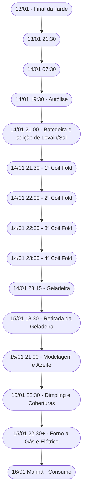

# Primeira Focaccia de 2025

Breve descrição:  
Receita de focaccia feita com levain (sourdough) em alta hidratação, fermentada lentamente e finalizada com tomate-cereja, azeite de oliva, alecrim e sal grosso.

---

## Informações Técnicas

- **Rendimento**: 1 focaccia média (forma retangular ~30×20 cm)  
- **Hidratação Total**: 100%  
  - (375 g de água ÷ 375 g de farinha) × 100  
- **Porcentagem de Levain**: 20% (75 g de levain ÷ 375 g de farinha × 100)

---

## Cronograma Detalhado

| Data/Hora            | Etapa                                                     |
| -------------------- | --------------------------------------------------------- |
| **13/01/2025 (final da tarde)** | Recebimento do levain de Nuno, no ápice.                      |
| **13/01/2025 à 21:30**          | 1ª renovação do levain: 20 g levain + 40 g água + 60 g farinha. |
| **14/01/2025 à 07:30**          | 2ª renovação do levain: 20 g levain + 60 g água + 90 g farinha, visando retardar fermentação no verão (~25 °C). |
| **14/01/2025 à 19:30**          | Início da autólise: 375 g de farinha + 280 g de água.           |
| **14/01/2025 à 21:00**          | Adição do levain (75 g), 85 g de água e 7,5 g de sal (diluídos em 10 g de água). Bater na batedeira até a massa descolar (~20 min). |
| **14/01/2025 à 21:30**          | 1º coil fold.                                                  |
| **14/01/2025 à 22:00**          | 2º coil fold.                                                  |
| **14/01/2025 à 22:30**          | 3º coil fold.                                                  |
| **14/01/2025 à 23:00**          | 4º coil fold.                                                  |
| **14/01/2025 à 23:15**          | Último coil fold; transferência da massa para recipiente maior e ida à geladeira. |
| **15/01/2025 à 18:30**          | Retirada da massa da geladeira para temperatura ambiente.       |
| **15/01/2025 à 21:00**          | Modelagem na assadeira (shaping tipo dobra, com azeite na superfície). |
| **15/01/2025 à 22:30**          | Dimpling, adição de tomate-cereja, alecrim e sal grosso. Forno a gás pré-aquecido (~250 °C). |
| **15/01/2025 (após ~30 min de forno a gás + ~8 min forno elétrico)** | Término do cozimento. Focaccia finalizada na pedra refratária (forno a gás) e dourada no forno elétrico (aquecimento superior). |
| **16/01/2025 pela manhã**       | Consumo do produto.                                           |

---

## Lista de Ingredientes (Massa Principal)

| Ingrediente                | Peso  | % Padeiro |
| -------------------------- | ----- | --------- |
| Farinha (5 Stagioni ORO)  | 375 g | 100%      |
| Água (total)              | 375 g | 100%      |
| Levain (ativo)            | 75 g  | 20%       |
| Sal                        | 7,5 g | 2%        |

**Hidratação total:** 100%

---

## Equipamentos Utilizados

- Recipientes de vidro ou plástico para misturas e dobras  
- Batedeira com gancho  
- Balança de precisão  
- Coqueteleira (ou pote) para diluir o levain  
- Assadeira (forma) untada com azeite  
- Forno a gás com pedra refratária  
- Forno elétrico (apenas aquecimento superior)  
- Termômetro para forno  
- Grade de resfriamento  

---

## Passo a Passo Detalhado

1. **Renovação do Levain:**  
   - 13/01/2025 à tarde: Pegue 20 g de levain, misture com 40 g de água e 60 g de farinha. Deixe fermentar.  
   - 14/01/2025 às 07:30: Nova renovação (20 g de levain + 60 g de água + 90 g de farinha) para retardar um pouco a fermentação no verão (~25 °C).

2. **Autólise (14/01/2025, 19:30):**  
   - Misture 375 g de farinha com 280 g de água.  
   - Deixe descansar até as 21:00 (~1h30).

3. **Mistura Principal (14/01/2025, 21:00):**  
   - Dilua 75 g de levain em 85 g de água (use uma coqueteleira ou pote) até ficar homogêneo.  
   - Dilua 7,5 g de sal em 10 g de água à parte.  
   - Junte tudo à massa autolisada.  
   - Bata na batedeira (vel. máxima) até perceber que a massa se desprende das laterais (~20 min).

4. **Dobras (Coil Folds):**  
   - 1º coil fold às 21:30.  
   - 2º coil fold às 22:00