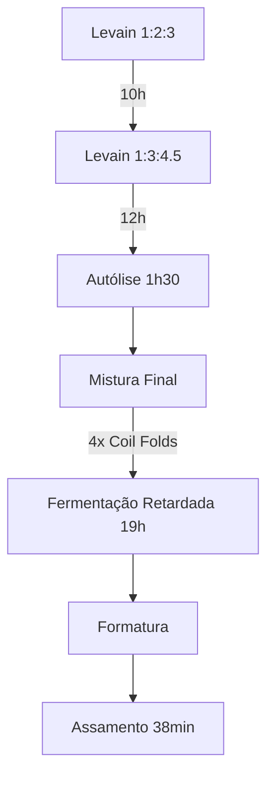

# Primeira Focaccia de 2025  
*Focaccia de fermentação natural com tomate cereja, alecrim e toque azedo característico*  

---

## Informações Técnicas  
- **Rendimento**: 1 focaccia (forma ~28x38cm)  
- **Hidratação Total**: 86%  
- **% Levain na massa**: 10.5%  
- **Temperatura ambiente**: ~25°C (verão)  
- **Farinhas utilizadas**:  
  - 5 Stagioni ORO (massa principal)  
  - La Manitoba 13% (levain)  

---

## Cronograma Processual  
### Dia 13/01/2025  
| Hora | Ação | Detalhes |  
|------|------|----------|  
| 21:30 | 1ª Renovação do Levain | 20g levain + 40g água + 60g farinha Manitoba |  

### Dia 14/01/2025  
| Hora | Ação | Detalhes |  
|------|------|----------|  
| 07:30 | 2ª Renovação do Levain | 20g levain + 60g água fria + 90g farinha Manitoba |  
| 19:30 | Início da Autólise | 280g água + 375g farinha 5 Stagioni |  
| 21:00 | Mistura Final | +75g levain +85g água +7.5g sal dissolvido |  
| 21:30-23:15 | Coil Folds | 4 folds (intervalos: 30/30/30/15 min) |  
| 23:15 | Fermentação Retardada | Geladeira por 19h15 |  

### Dia 15/01/2025  
| Hora | Ação | Detalhes |  
|------|------|----------|  
| 18:30 | Retirada da Geladeira | Aclimatação por 2h30 |  
| 21:00 | Formatura | Dobra tipo "shaping" + azeite |  
| 22:30 | Assamento | 30min forno gás (250°C) + 8min forno elétrico |  

---

## Formulação Matemática  
### Ingredientes Principais  
| Componente | Massa (g) | % Baker's |  
|------------|-----------|-----------|  
| Farinha TOTAL | 465 | 100% |  
| Água TOTAL | 401 | 86% |  
| Sal | 7.5 | 1.6% |  
| Levain | 75 | 16.1% |  

```math
\text{Hidratação} = \frac{\text{Água Total (401g)}}{\text{Farinha Total (465g)}} \times 100 = 86\%
```

---

## Protocolo Técnico  
### 1. Gestão do Levain  
```text
13/01 21:30 - 14/01 07:30: 
  1ª Renovação → 20g starter + 40g água + 60g Manitoba (1:2:3)

14/01 07:30 - 19:30: 
  2ª Renovação → 20g starter + 60g água fria + 90g Manitoba (1:3:4.5)
  Comportamento: 100g → 200g (5h) → 400g (12h) → queda
```

### 2. Desenvolvimento da Massa  
```text
19:30-21:00: Autólise (1h30)
21:00-21:20: Mistura final (batedeira velocidade máxima)
21:30-23:15: 
  Coil Fold Sequence:
  1. 21:30 - 2. 22:00 - 3. 22:30 - 4. 23:15
  Textura observada: "Descolou do bowl rapidamente"
```

### 3. Regime Térmico  
```text
Fermentação Primária: 1h45 (25°C)  
Fermentação Retardada: 19h15 (4°C)  
Tempo Total Fermentação: 21h  
```

---

## Análise Sensorial  
### Resultados Obtidos  
```text
- Miolo: Aerado ("bolhas irregulares")  
- Sabor: "Azedinho saliente"  
- Textura: Crocante inicial → Macio após 12h  
- Cor: Irregular ("pontos quase queimados")  
```

### Matriz de Melhorias (PDCA)  
| Fator | Problema | Solução Proposta |  
|-------|----------|-------------------|  
| Controle do Levain | Usado após queda (400g) | Coletar no ápice (300-350g) |  
| Temperatura de Assamento | Gradiente desigual | Pré-aquecer pedra 1h + forno único |  
| Crocância | Perda pós-esfriamento | Reaquecimento a 180°C por 5min |  

---

## Diagrama de Processo  


---

## Registro de Aprendizado  
```text
Key Insight: 
  "Fermentação prolongada em clima quente (25°C) exige: 
  1. Hidratação elevada (>80%) 
  2. Uso estratégico de água fria 
  3. Retardo refrigerado para controle"

Descoberta: 
  "Massa descolando do bowl em 20min indica: 
  - Desenvolvimento glúten ideal 
  - Necessidade reduzida de folds"
``` 

---

## Nota do Chefe de Pães  
> "O uso combinado de Manitoba (força) e 5 Stagioni (extensão) criou uma rede de glúten equilibrada. Para próxima iteração: testar 5% de semolina para melhorar crocância basal."

```diff
+ Ponto Forte: Gestão de temperatura com água fria no levain
- Ponto de Atenção: Janela de 12h entre última alimentação e uso permitiu overfermentação
```

---

📌 **Documentação Finalizada em**: 16/01/2025