# Primeira Focaccia de 2025

Uma focaccia de fermentação natural (Levain/Sourdough) feita durante o verão de 2025, aproveitando um levain ativo cultivado ao longo de alguns dias. O resultado foi uma massa macia, aerada, com notas levemente ácidas, muito saborosas, coroada com tomate-cereja, alecrim e sal grosso. A conclusão é de que, para um sabor mais neutro, o ideal seria utilizar o levain no seu ápice e reduzir o tempo de retardo em geladeira.

---

## Informações Técnicas

- **Data de início:** 13/01/2025 (renovação do Levain no final da tarde)  
- **Data de finalização:** 15/01/2025 (asse a focaccia no final da noite)  
- **Rendimento:** 1 focaccia grande (forma retangular média)  
- **Hidratação:** 100% (considerando apenas a farinha da massa principal e toda a água adicionada, ignorando a água do levain)  
- **Percentual de Levain (em relação à farinha da massa principal):** 20%

---

## Cronograma Resumido

| Data / Horário           | Atividade                                                      |
|--------------------------|----------------------------------------------------------------|
| **13/01/2025 (tarde)**   | Pegou o pote de levain “Nuno” ativo.                          |
| **13/01/2025 - 21h30**   | 1ª Renovação: 20g levain + 40g água + 60g farinha.             |
| **14/01/2025 - 07h30**   | 2ª Renovação: 20g levain + 60g água (fria) + 90g farinha.      |
| **14/01/2025 - 19h30**   | Autólise: 375g farinha + 280g água.                            |
| **14/01/2025 - 21h00**   | Mistura final: +75g levain + 85g água + 7,5g sal + 10g água.   |
| **14/01/2025 - 21h30**   | 1º Coil Fold.                                                 |
| **14/01/2025 - 22h00**   | 2º Coil Fold.                                                 |
| **14/01/2025 - 22h30**   | 3º Coil Fold.                                                 |
| **14/01/2025 - 23h00**   | 4º Coil Fold.                                                 |
| **14/01/2025 - 23h15**   | Transferência da massa para outro recipiente e geladeira.      |
| **15/01/2025 - 17h30**   | Massa ainda na geladeira.                                     |
| **15/01/2025 - 18h30**   | Retirada da massa da geladeira para temperatura ambiente.      |
| **15/01/2025 - 21h00**   | Modelagem na assadeira, dobra e descanso.                     |
| **15/01/2025 - 22h30**   | Dimpling, cobertura com tomate-cereja, alecrim, sal e azeite.  |
| **15/01/2025 - ~22h40**  | Forno a gás (30min) + forno elétrico (8min) para dourar.       |
| **16/01/2025 (manhã)**   | Consumo no café da manhã (massa macia e aerada, moderado azedo). |

---

## Lista de Ingredientes (Massa Principal)

A tabela a seguir apresenta os ingredientes da **massa principal**, desconsiderando a água contida no Levain para fins de hidratação.

| Ingrediente           | Peso   | Percentual de Padeiro |
|-----------------------|--------|-----------------------|
| Farinha (5 Stagioni) | 375g   | 100%                  |
| Água (total)         | 375g   | 100%                  |
| Levain (starter)     | 75g    | 20%                   |
| Sal                  | 7,5g   | ~2%                   |

**Hidratação Total (sem contar a água do levain):** 100%

> A farinha para o **Levain** (quando renovado) foi a La Manitoba (13% proteínas), mas para a **massa final** utilizou-se a Farinha 5 Stagioni ORO.

---

## Equipamentos Utilizados

- Recipiente de vidro ou plástico para autólise e/ou mistura.  
- Batedeira com gancho (suportando massas mais hidratadas).  
- Recipiente grande para fermentação e repouso na geladeira.  
- Forma ou assadeira untada para a focaccia.  
- Pedra refratária (no fundo do forno a gás).  
- Forno a gás (para a maior parte do cozimento).  
- Forno elétrico (apenas para dourar a cobertura).  
- Termômetro de forno.  
- Grade para resfriar.

---

## Passo a Passo Detalhado

1. ### Preparação do Levain
   - **13/01/2025 - 21h30**  
     - Renovar o Levain (“Nuno”) com proporção 1:2:3  
       - 20g de Levain + 40g de água + 60g de farinha.  
     - Deixar em temperatura ambiente (cerca de 25 °C).
   - **14/01/2025 - 07h30**  
     - Nova renovação do Levain com água fria, para retardar um pouco o crescimento:  
       - 20g de Levain + 60g de água + 90g de farinha.  
     - Temperatura média de 25 °C, visando que o Levain chegaria ao ápice por volta do fim do dia.

2. ### Autólise da Massa
   - **14/01/2025 - 19h30**  
     - Misturar, sem sovar muito, **375g de farinha 5 Stagioni** com **280g de água**.  
     - Deixar em repouso (autólise) até às 21h (cerca de 1h30 de descanso).

3. ### Mistura Final
   - **14/01/2025 - 21h00**  
     - Em uma coqueteleira ou recipiente à parte, misturar **75g de Levain** com **85g de água** e agitar bem.  
     - Dissolver **7,5g de sal** em **10g de água**.  
     - Juntar ambas as soluções à massa em autólise e levar à batedeira (gancho).  
     - Bater em velocidade máxima até a massa começar a se desprender das paredes (aprox. 20min).  
       - Observação: Foi percebido que se desprendeu do pote mais rapidamente do que em experiências anteriores.

4. ### Primeira Fermentação (Folds e Descanso)
   - **14/01/2025 - 21h30**: 1º coil fold.  
   - **14/01/2025 - 22h00**: 2º coil fold.  
   - **14/01/2025 - 22h30**: 3º coil fold.  
   - **14/01/2025 - 23h00**: 4º coil fold.  
   - **14/01/2025 - 23h15**: Transferir a massa para um recipiente maior, tampar e levar à geladeira.

5. ### Retardo em Geladeira
   - A massa ficou na geladeira desde **14/01/2025 - 23h15** até **15/01/2025 - 17h30** (aproximadamente 18h).  
   - **15/01/2025 - 18h30**: Retirar a massa da geladeira e deixar em temperatura ambiente por cerca de 2h30.

6. ### Modelagem e Conformação na Assadeira
   - **15/01/2025 - 21h00**: Untar a forma com azeite, transferir a massa e fazer uma dobra simples, deixando a emenda para baixo. Cobrir levemente a superfície com azeite.

7. ### Cobertura e Pré-Assamento
   - **15/01/2025 - 22h30**:  
     - Adicionar mais azeite sobre a massa, fazer “dimplings” (pressões com os dedos), espalhando suavemente até a massa ocupar toda a base da forma.  
     - Colocar tomate-cereja cortado ao meio, alecrim fresco e sal grosso no topo.

8. ### Assamento
   - **Forno a Gás (com pedra refratária)**  
     - Pré-aquecer ao máximo (termômetro marcava ~250 °C).  
     - Assar por cerca de **30 minutos** na parte inferior sobre a pedra refratária.  
   - **Forno Elétrico (apenas resistência superior)**  
     - Pré-aquecer no máximo.  
     - Transferir a focaccia por mais **8 minutos**, até dourar.  
     - Retirar assim que surgirem pontos quase queimados (cuidado no douramento).  
   - **Resfriamento**  
     - Remover imediatamente da forma e colocar sobre uma grade para esfriar.

---

## Documentação do Resultado

- **Base:** Ficou crocante, porém com cor levemente irregular.  
- **Miolo:** Aerado, bastante macio, com leve acidez perceptível.  
- **Temperatura ambiente média:** 25 °C.  
- **Observação sobre sabor:** Notou-se um azedinho, possivelmente pela queda do Levain após o ápice e pelo longo tempo na geladeira.  
- **Consumo:** No café da manhã de 16/01/2025, a focaccia ainda estava macia, embora já não tão crocante.

```admonish tip
Para maior crocância no momento do consumo, pode-se aquecer rapidamente no forno ou na airfryer antes de servir.
```

---

## Dicas e Observações

1. **Sobre o Levain**  
   - O Levain “Nuno” atingiu o ápice (marca de 400g) antes de ser utilizado, mas já apresentava início de queda. Isso acresceu um sabor ácido à focaccia. Para quem prefere uma acidez mais suave, vale usar o Levain ainda em seu pico ou reduzir o tempo de retardo.  

2. **Sobre o Retardo na Geladeira**  
   - Deixar a massa por muitas horas na geladeira imprime mais sabor e complexidade, mas pode acentuar o azedinho.

3. **Cobertura**  
   - Tomate-cereja, alecrim fresco e sal grosso funcionaram bem para dar sabor e visual atraente.  
   - O forno elétrico auxiliou a formar uma coloração mais dourada na superfície.

```admonish warning
Caso seu forno tenha chama apenas inferior (ou apenas superior), fique atento para não queimar o fundo antes de dourar o topo, ou vice-versa.
```

---

## Diagrama do Processo (Mermaid)

```mermaid
flowchart LR
    A([13/01<br>Levain ativo]) --> B(13/01 - 21h30<br>Renovação 1:2:3)
    B --> C(14/01 - 07h30<br>Renovação com água fria)
    C --> D(14/01 - 19h30<br>Autólise: 375g farinha + 280g água)
    D --> E(14/01 - 21h<br>Mistura final + Levain + Sal)
    E --> F(Coils: 21h30 - 23h15)
    F --> G(Frigorificação<br>14/01 - 23h15 até 15/01 - 17h30)
    G --> H(15/01 - 18h30<br>Aquecer a massa à temp. ambiente)
    H --> I(15/01 - 21h<br>Modelagem na forma)
    I --> J(15/01 - 22h30<br>Dimples + Cobertura)
    J --> K(Forno a gás 30min + Forno elétrico 8min)
    K --> L([16/01<br>Consumo e Observações])
```



---

## Análise Crítica

Durante o processo, foi observado:

- **Pontos de Acerto**  
  - Autólise longa (1h30) facilitou a formação de glúten.  
  - Os coil folds a cada 30 minutos ajudaram a desenvolver a estrutura da massa, mesmo com 100% de hidratação.  
  - O uso do forno elétrico para finalizar o douramento da superfície funcionou muito bem.

- **Pontos a Melhorar**  
  - Para reduzir a acidez, utilizar o Levain no ápice (sem sinais de queda) ou diminuir o tempo na geladeira.  
  - Monitorar com mais atenção o ponto de cor e uniformidade do assamento (possivelmente, usar modos combinados de calor superior/inferior simultâneos ou reposicionar a assadeira).

```admonish info
Cada forno tem suas particularidades. Ajuste os tempos de assamento conforme a resposta da massa e cor desejada.
```
