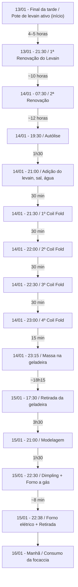

# Primeira Focaccia de 2025

Uma focaccia fermentada naturalmente com levain (fermento natural), passando por autólise e dobras (coil folds), seguida de longa maturação em geladeira. O resultado foi uma massa macia, bem aerada e com sabor ligeiramente azedo, apreciada por toda a família.

## Informações Técnicas

- **Rendimento**: 1 focaccia média (forma retangular padrão)  
- **Hidratação Total**: 100%  
  - Cálculo:  
    \[
    \text{Hidratação} = \frac{\text{Água total adicionada}}{\text{Farinha total}} \times 100
    = \frac{375\,g}{375\,g} \times 100
    = 100\%
    \]
- **Porcentagem de Levain**: 20%  
  - Cálculo:
    \[
    \frac{75\,g\ \text{(Levain)}}{375\,g\ \text{(Farinha)}} \times 100
    = 20\%
    \]

## Cronograma Detalhado

| Data       | Horário          | Ação                                                                                                                     | Duração (desde a etapa anterior) |
|------------|------------------|--------------------------------------------------------------------------------------------------------------------------|----------------------------------|
| **13/01**  | Final da tarde  | Pote de levain ativo retirado com o amigo Nuno.                                                                          | –                                |
| **13/01**  | 21:30           | Renovação do levain (1:2:3).                                                                                             | 4–5 horas após receber o levain  |
| **14/01**  | 07:30           | 2ª Renovação do levain.                                                                                                  | ~10 horas após a 1ª renovação    |
| **14/01**  | 19:30           | Início da autólise (280 g de água + 375 g de farinha).                                                                    | ~12 horas após a 2ª renovação    |
| **14/01**  | 21:00           | Adição do levain (75 g), sal (7,5 g) e água (85 g + 10 g), mistura na batedeira.                                          | 1h30 após o início da autólise   |
| **14/01**  | 21:30           | 1º coil fold.                                                                                                             | 30 min após a mistura            |
| **14/01**  | 22:00           | 2º coil fold.                                                                                                             | 30 min                            |
| **14/01**  | 22:30           | 3º coil fold.                                                                                                             | 30 min                            |
| **14/01**  | 23:00           | 4º coil fold.                                                                                                             | 30 min                            |
| **14/01**  | 23:15           | Massa transferida para recipiente maior, tampada e levada à geladeira.                                                    | 15 min                            |
| **15/01**  | 17:30           | Massa retirada da geladeira e deixada em temperatura ambiente.                                                             | ~18h15 após ir à geladeira       |
| **15/01**  | 21:00           | Modelagem na forma untada.                                                                                                 | 3h30 após sair da geladeira      |
| **15/01**  | 22:30           | Dimpling, coberturas (tomates, alecrim, sal grosso, azeite) e forno a gás (~30 min).                                       | 1h30 após modelagem              |
| **15/01**  | 22:38 (aprox.)  | Transição para forno elétrico (~8 min) e retirada do forno.                                                                | ~8 min após o forno a gás        |
| **16/01**  | Manhã           | Consumo da focaccia no café da manhã.                                                                                     | –                                |

## Ingredientes

### Massa Principal

| Ingrediente                | Peso   | % de Padeiro |
|----------------------------|--------|-------------:|
| Farinha (5 Stagioni ORO)  | 375 g  |  100%        |
| Água (total)              | 375 g  |  100%        |
| Levain (ativo)            | 75 g   |   20%        |
| Sal                        | 7,5 g  |    2%        |

- **Hidratação Total**: 100%

### Cobertura

- Azeite de oliva  
- Tomates-cereja  
- Alecrim fresco  
- Sal grosso  

## Equipamentos Utilizados

- Recipiente de vidro (Marinex) ou tigela grande para a massa  
- Batedeira planetária com gancho  
- Forma retangular untada  
- Pedra refratária (no forno a gás)  
- Forno a gás (aquecimento inferior) e forno elétrico (aquecimento superior)  
- Termômetro para forno  
- Grade para resfriamento  

## Passo a Passo Detalhado

1. **Renovação do Levain (13/01 - 21:30)**  
   - Misture 20 g de levain, 40 g de água e 60 g de farinha.  
   - Deixe fermentar até o dia seguinte.

2. **2ª Renovação do Levain (14/01 - 07:30)**  
   - Misture 20 g de levain, 60 g de água fria e 90 g de farinha.  
   - Deixe em local fresco, visando usar o levain no final do dia.

3. **Autólise (14/01 - 19:30)**  
   - Em uma tigela ou recipiente grande, misture 280 g de água com 375 g de farinha.  
   - Deixe em repouso até a próxima etapa (cerca de 1h30).

4. **Preparo da Massa (14/01 - 21:00)**  
   - Dilua 75 g de levain em 85 g de água, batendo bem (pode usar coqueteleira ou fouet).  
   - Dilua 7,5 g de sal em 10 g de água.  
   - Adicione ambas as soluções (levain e sal) à mistura de autólise.  
   - Bata em batedeira com gancho em velocidade máxima até a massa se desprender das laterais (cerca de 20 minutos).  
   - Transfira a massa para um recipiente grande (ou Marinex).

5. **Dobra e Fermentação (coil folds)**  
   - Faça a 1ª dobra (coil fold) às 21:30.  
   - Repita as dobras a cada 30 minutos (22:00, 22:30 e 23:00).  
   - Às 23:15, transfira a massa para um recipiente maior com tampa e leve à geladeira para longa fermentação.

6. **Retirada da Geladeira (15/01 - 17:30)**  
   - Retire a massa da geladeira e deixe em temperatura ambiente até próximo do momento de modelar.

7. **Modelagem (15/01 - 21:00)**  
   - Unte a forma com azeite.  
   - Vire a massa na forma e faça uma dobra simples (tipo envelope).  
   - Deixe a dobra voltada para baixo.  
   - Cubra com azeite na superfície.

8. **Pré-Aquecimento do Forno**  
   - Forno a gás com pedra refratária no máximo (~250 °C).  
   - Forno elétrico ligado posteriormente para gratinar a parte superior.

9. **Dimpling e Coberturas (15/01 - 22:30)**  
   - Regue a superfície com azeite de oliva.  
   - Faça o dimpling, pressionando levemente os dedos para espalhar a massa.  
   - Adicione tomates-cereja cortados ao meio, alecrim fresco e sal grosso.

10. **Assamento**  
    - Leve ao forno a gás (~250 °C) diretamente sobre a pedra refratária por cerca de 30 minutos.  
    - Em seguida, transfira para o forno elétrico (também pré-aquecido) por mais ~8 minutos para dourar a superfície.

11. **Resfriamento e Consumo**  
    - Retire a focaccia do forno ao perceber leve dourado (cuidado com pontos que possam queimar).  
    - Desenforme e coloque sobre uma grade para esfriar.  
    - Consuma imediatamente ou, como feito no relato, no café da manhã do dia seguinte.

## Diagrama do Processo



## Dicas, Dificuldades e Descobertas

```admonish tip
- **Uso do Levain**: Se preferir sabor menos ácido, use o levain ainda no ápice e reduza o tempo de fermentação.
```

```admonish info
- **Controle de Temperatura**: No verão, mesmo usando água fria, o fermento acelera. A programação de horários ajuda a ajustar o ponto ideal do levain.
```

```admonish important
- **Retardo em Geladeira**: A longa fermentação (cerca de 18 horas) contribuiu para sabor acentuado e maior desenvolvimento do glúten.
```

## Observações Extras

- O levain do Nuno (proporção 1:2:3) apresentou picos de crescimento antecipados, indicando que o ápice havia passado levemente ao ser utilizado (massa levemente azeda).  
- A coloração da focaccia não ficou totalmente uniforme; parte disso se deve ao uso de dois fornos diferentes (a gás e elétrico) em sequência.  
- A crocância da base foi excelente no momento em que saiu do forno, mas reduziu na manhã seguinte, algo esperado em pães de fermentação natural.

## Análise Crítica

- **Acertos**  
  - Massa muito macia e bem aerada.  
  - Sabor agradável, com acidez equilibrada (para quem aprecia um toque mais azedo).  
  - Uso combinado de fornos (gás e elétrico) para assar e dourar a superfície.

- **Pontos de Melhoria**  
  - Para quem prefere menor acidez, ajustar o ponto do levain e reduzir o tempo de geladeira.  
  - Atenção ao forno elétrico para evitar pontos que queimem antes de dourar por igual.  
  - Consumir logo após sair do forno garante melhor crocância.